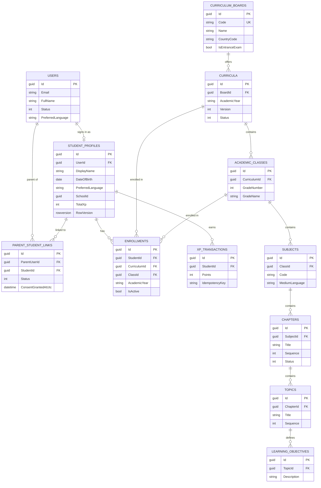

# Database ER Diagram

Solid boxes exist in code now; the second diagram shows the planned model by phase.

## Implemented (Phase 3 foundation)

```mermaid
erDiagram
  USERS ||--o| STUDENT_PROFILES : "signs in as"
  USERS ||--o{ PARENT_STUDENT_LINKS : "parent of"
  STUDENT_PROFILES ||--o{ PARENT_STUDENT_LINKS : "linked to"
  STUDENT_PROFILES ||--o{ ENROLLMENTS : has
  STUDENT_PROFILES ||--o{ XP_TRANSACTIONS : earns
  CURRICULUM_BOARDS ||--o{ CURRICULA : offers
  CURRICULA ||--o{ ACADEMIC_CLASSES : contains
  CURRICULA ||--o{ ENROLLMENTS : "enrolled in"
  ACADEMIC_CLASSES ||--o{ ENROLLMENTS : "enrolled in"
  ACADEMIC_CLASSES ||--o{ SUBJECTS : contains
  SUBJECTS ||--o{ CHAPTERS : contains
  CHAPTERS ||--o{ TOPICS : contains
  TOPICS ||--o{ LEARNING_OBJECTIVES : defines

  USERS { guid Id PK string Email string FullName int Status string PreferredLanguage }
  STUDENT_PROFILES { guid Id PK guid UserId FK string DisplayName date DateOfBirth string PreferredLanguage guid SchoolId int TotalXp rowversion RowVersion }
  PARENT_STUDENT_LINKS { guid Id PK guid ParentUserId FK guid StudentId FK int Status datetime ConsentGrantedAtUtc }
  ENROLLMENTS { guid Id PK guid StudentId FK guid CurriculumId FK guid ClassId FK string AcademicYear bool IsActive }
  CURRICULUM_BOARDS { guid Id PK string Code UK string Name string CountryCode bool IsEntranceExam }
  CURRICULA { guid Id PK guid BoardId FK string AcademicYear int Version int Status }
  ACADEMIC_CLASSES { guid Id PK guid CurriculumId FK int GradeNumber string GradeName }
  SUBJECTS { guid Id PK guid ClassId FK string Code string MediumLanguage }
  CHAPTERS { guid Id PK guid SubjectId FK string Title int Sequence int Status }
  TOPICS { guid Id PK guid ChapterId FK string Title int Sequence }
  LEARNING_OBJECTIVES { guid Id PK guid TopicId FK string Description }
  XP_TRANSACTIONS { guid Id PK guid StudentId FK int Points string IdempotencyKey }
```

## Planned full model

```mermaid
erDiagram
  TOPICS ||--o{ LEARNING_CONTENT : has
  LEARNING_CONTENT ||--o{ CONTENT_SOURCES : "cited from"
  STUDENT_PROFILES ||--o{ LEARNING_PROGRESS : tracks
  TOPICS ||--o{ LEARNING_PROGRESS : measures
  STUDENT_PROFILES ||--o{ STUDY_PLANS : follows
  STUDY_PLANS ||--o{ STUDY_PLAN_TASKS : contains
  STUDENT_PROFILES ||--o{ AI_CONVERSATIONS : starts
  AI_CONVERSATIONS ||--o{ AI_MESSAGES : contains
  AI_MESSAGES ||--o{ AI_CONTENT_REFERENCES : cites
  LEARNING_CONTENT ||--o{ AI_CONTENT_REFERENCES : "cited by"
  TOPICS ||--o{ QUESTIONS : "bank for"
  QUESTIONS ||--o{ QUESTION_OPTIONS : has
  QUESTIONS ||--|| QUESTION_ANSWER_KEYS : has
  ASSESSMENTS ||--o{ ASSESSMENT_QUESTIONS : includes
  QUESTIONS ||--o{ ASSESSMENT_QUESTIONS : "used in"
  ASSESSMENTS ||--o{ EXAM_ATTEMPTS : "taken as"
  STUDENT_PROFILES ||--o{ EXAM_ATTEMPTS : takes
  EXAM_ATTEMPTS ||--o{ STUDENT_ANSWERS : records
  EXAM_ATTEMPTS ||--|| ASSESSMENT_RESULTS : produces
  BADGES ||--o{ STUDENT_BADGES : awarded
  STUDENT_PROFILES ||--o{ STUDENT_BADGES : receives
  SCHOOLS ||--o{ SCHOOL_MEMBERSHIPS : has
  SCHOOLS ||--o{ CLASSROOMS : runs
  CLASSROOMS ||--o{ CLASSROOM_STUDENTS : enrolls
  CLASSROOMS ||--o{ CLASSROOM_TEACHERS : "taught by"
  CLASSROOMS ||--o{ ASSIGNMENTS : sets
  ASSIGNMENTS ||--o{ ASSIGNMENT_SUBMISSIONS : receives
  SUBSCRIPTION_PLANS ||--o{ SUBSCRIPTIONS : "sold as"
  SUBSCRIPTIONS ||--o{ PAYMENTS : "paid by"
  PAYMENTS ||--o| INVOICES : generates
```
